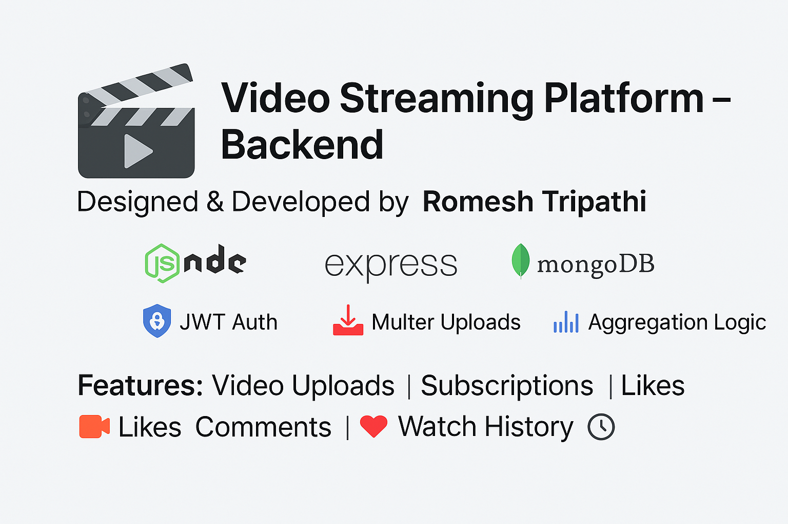

# 🎬 Video Streaming Platform – Backend



A modular, production-grade backend built with **Node.js, Express, and MongoDB**, powering core features of a video streaming application — from secure user authentication and file uploads to channel subscriptions, commenting, and video lifecycle management.

---

## 🚀 Features

- ✅ **JWT-based Authentication** with refresh token support
- 📹 **Video Management**: Upload, update, publish, thumbnail editing & deletion
- 🖼️ **User Profiles**: Avatar & cover image uploads with profile editing
- 🔔 **Subscriptions**: Toggle subscribe/unsubscribe with aggregation metadata
- 💬 **Commenting System**: Add/edit/delete video comments
- 📊 **Watch History Tracking** per user
- 📂 **Secure File Uploads** via `multer` (cloud-ready schemas)
- ⚠️ **Centralized Error Handling** with `ApiError` class and `GlobalErrorHandler`
- 🧾 **Versioned API**: `/api/v1/` for maintainability and future upgrades
- ❤️ **Like System**: Track user likes on videos and/or comments
- 🎶 **Playlists**: Users can create and manage video playlists
- 📁 **Modular Utilities**: Cloud upload service, response wrappers, constants
- 🧹 **Async Error Handling** with `asyncHandler` to eliminate try-catch clutter

## 🛠️ Utility Layer

- `ApiError` / `ApiResponse`: Unified response and error interface
- `asyncHandler`: Clean async route wrapping
- `cloudinary.service.js`: Abstraction for media upload handling
- `UtilityMethods.js`: Reusable helpers and computed logic
- `constants.js`: Centralized values and enums

---

## 🧱 Project Structure

```bash
src/
├── controllers/ # Business logic for users, videos, comments, likes, playlists
├── db/ # MongoDB connection config
├── middlewares/ # Auth guards, file uploads, error handler
├── models/ # Mongoose schemas: User, Video, Subscription, Playlist, Like, Comment
├── routes/ # Express routers for each domain
├── utils/ # Reusable helpers: ApiError, ApiResponse, asyncHandler, cloudinary service
└── app.js # Express app initialization

public/
└── temp/ # Temporary file storage (.gitkeep)
```

---

## 📜 API Reference

### 👤 User Endpoints (`/api/v1/users`)

| Method | Route              | Description                                      |
| ------ | ------------------ | ------------------------------------------------ |
| POST   | `/register`        | Register user with avatar and cover image upload |
| POST   | `/login`           | Authenticate and receive token                   |
| GET    | `/channel`         | Get channel profile with subscription metadata   |
| POST   | `/logout`          | Log out and invalidate tokens                    |
| PATCH  | `/change-password` | Change current password                          |
| PATCH  | `/profile`         | Update profile details                           |
| PATCH  | `/update-avatar`   | Upload a new avatar image                        |
| GET    | `/me`              | Fetch authenticated user profile                 |
| POST   | `/subscribe`       | Subscribe/unsubscribe from a channel             |
| GET    | `/watch-history`   | Get user’s video watch history                   |

---

### 📹 Video Endpoints (`/api/v1/videos`)

| Method | Route            | Description                                 |
| ------ | ---------------- | ------------------------------------------- |
| POST   | `/upload`        | Upload video and thumbnail                  |
| POST   | `/thumbnail/:id` | Update video thumbnail                      |
| GET    | `/video/:id`     | Fetch video by ID                           |
| GET    | `/my-videos`     | List current user's uploaded videos         |
| DELETE | `/delete/:id`    | Delete video (if owner)                     |
| PATCH  | `/update/:id`    | Modify video metadata                       |
| PATCH  | `/publish/:id`   | Toggle publish/unpublish status             |
| GET    | `/health-check`  | Simple route to verify video service health |

---

### 💬 Comment Endpoints (`/api/v1/comments`)

| Method | Route     | Description                  |
| ------ | --------- | ---------------------------- |
| POST   | `/new`    | Add a comment to a video     |
| PATCH  | `/edit`   | Update a comment             |
| DELETE | `/delete` | Remove a comment             |
| GET    | `/`       | Get all comments for a video |
| GET    | `/health` | Comment service health check |

---

### ❤️ Like Endpoints (`/api/v1/likes`)

| Method | Route     | Description                       |
| ------ | --------- | --------------------------------- |
| POST   | `/toggle` | Like or unlike a video or comment |

---

### 🎶 Playlist Endpoints (`/api/v1/playlists`)

| Method | Route           | Description                       |
| ------ | --------------- | --------------------------------- |
| POST   | `/create`       | Create a new playlist             |
| POST   | `/add-video`    | Add video to playlist             |
| DELETE | `/remove-video` | Remove video from playlist        |
| GET    | `/my-playlists` | Get all playlists created by user |

---

## 📦 Technologies Used

| Layer        | Stack                                     |
| ------------ | ----------------------------------------- |
| Server       | Node.js + Express.js                      |
| Database     | MongoDB + Mongoose                        |
| Auth         | JWT-based with token expiry logic         |
| File Uploads | Multer + cloudinary-ready schemas         |
| Pagination   | `mongoose-aggregate-paginate-v2`          |
| Utilities    | `ApiError`, `ApiResponse`, `asyncHandler` |

---

## 🔐 Auth Flow Overview

- On login/register: Access + refresh tokens generated and returned
- Protected routes require `verifyJWT` middleware
- Refresh flow handled securely via token storage in DB
- Role enforcement via `verifyVideoAuthor`, etc.

---

## 📊 Aggregation Capabilities

Used MongoDB aggregation pipelines to:

- Count channel subscribers and subscribed channels
- Determine if current viewer is subscribed
- Flatten subscription logic for profile enrichment
- Track and retrieve user watch history
- Paginate video results efficiently

---

## ⚙️ Setup Instructions

```bash
git clone https://github.com/RomeshKTripathi/BackendVideoStreamingPlatform.git
cd backend-video-streaming
npm install
npm run dev
```

---

### Configure your .env file with:

```js
ACCESS_TOKEN_SECRET=yourSecretKey
REFRESH_TOKEN_SECRET=yourRefreshSecret
ACCESS_TOKEN_EXPIRY=1h
REFRESH_TOKEN_EXPIRY=7d
CORS_ORIGIN=http://localhost:3000
MONGO_URI=mongodb://localhost:27017/yourDB
```

🧑‍💻 Author
Romesh Tripathi
Aspiring Full-Stack Engineer passionate about backend architecture, scalable APIs, and clean code design.

- 🧠 MERN focused
- 📊 Strengths in aggregation, modular services, and secure API development
- 💼 LinkedIn 🛠️ Portfolio 🌐 GitHub

---
